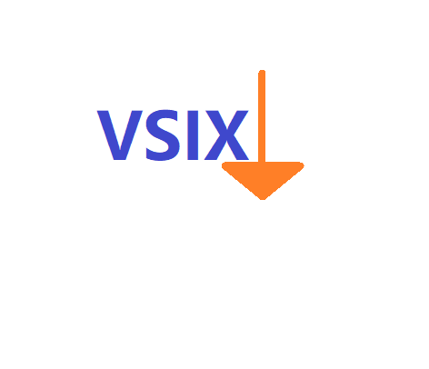

# VS Code Marketplace VSIX Downloader Extension

## English

### 📖 Overview
This browser extension adds a "Download VSIX" button to the Visual Studio Code Marketplace. It allows you to directly download the latest `.vsix` installation package for any extension from its official marketplace page.

### ✨ Features
- Adds a prominent download button to VS Code Marketplace pages
- One-click download of the latest VSIX file
- Real-time download status updates
- Automatic filename generation (publisher.extension-name-version.vsix)
- Clean, professional UI that matches VS Code's design language

### ⚙️ Installation
1. Clone or download this repository
2. Open Chrome/Edge browser and go to `chrome://extensions/`
3. Enable "Developer mode" (toggle in top-right corner)
4. Click "Load unpacked" and select the extension folder
5. The extension is now installed and active

### 🚀 Usage
1. Visit any VS Code extension page on the marketplace, e.g.:  
   `https://marketplace.visualstudio.com/items?itemName=ms-python.python`
2. Find the "VSIX Downloader" section below the extension details
3. Click the "Download Latest VSIX" button
4. The download will start automatically with status updates
5. Once downloaded, install in VS Code via:  
   Extensions view → ⋯ → "Install from VSIX"

### ⚠️ Notes
1. Only works on official VS Code Marketplace URLs
2. Requires Chrome, Edge, or other Chromium-based browsers
3. If VS Code changes their page structure, the extension may need updating
4. Downloaded files are standard VSIX packages - install at your own risk

### 🛠 Development
To modify or extend the project:
- `manifest.json`: Extension configuration
- `content.js`: Main script that injects the UI
- `background.js`: Handles download requests
- `button.html`: UI template (optional)

### 📜 License
MIT License - Free for personal and commercial use

---

## 中文

### 📖 概述
本浏览器扩展为 Visual Studio Code 官方插件市场添加"下载 VSIX"按钮。您可以直接从任何插件的官方页面下载最新版本的`.vsix`安装包。

### ✨ 功能特点
- 在 VS Code 插件市场页面添加醒目的下载按钮
- 一键下载最新版 VSIX 文件
- 实时下载状态更新
- 自动生成文件名（发布者.插件名-版本.vsix）
- 简洁专业的 UI 设计，匹配 VS Code 风格

### ⚙️ 安装方法
1. 克隆或下载本仓库
2. 打开 Chrome/Edge 浏览器，访问 `chrome://extensions/`
3. 启用"开发者模式"（右上角切换开关）
4. 点击"加载已解压的扩展程序"，选择扩展文件夹
5. 扩展现已安装并激活

### 🚀 使用说明
1. 访问任何 VS Code 插件页面，例如：  
   `https://marketplace.visualstudio.com/items?itemName=ms-python.python`
2. 在插件详情下方找到"VSIX 下载器"区域
3. 点击"下载最新版本 VSIX"按钮
4. 下载将自动开始，并显示状态更新
5. 下载完成后，在 VS Code 中通过以下方式安装：  
   扩展视图 → ⋯ → "从VSIX安装"

### ⚠️ 注意事项
1. 仅适用于官方 VS Code 插件市场页面
2. 需要 Chrome、Edge 或其他基于 Chromium 的浏览器
3. 如果 VS Code 更改页面结构，扩展可能需要更新
4. 下载的文件为标准 VSIX 包 - 请自行承担安装风险

### 🛠 开发说明
项目结构：
- `manifest.json`: 扩展配置文件
- `content.js`: 主脚本（注入UI）
- `background.js`: 处理下载请求
- `button.html`: UI模板（可选）

### 📜 许可证
MIT 许可证 - 免费用于个人和商业用途

---

**Enjoy easier VSIX downloads! / 享受更便捷的 VSIX 下载体验！**
